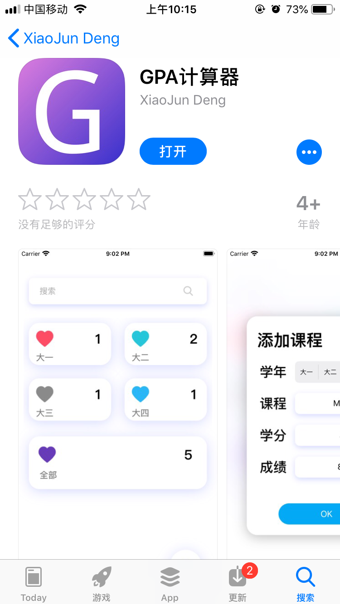
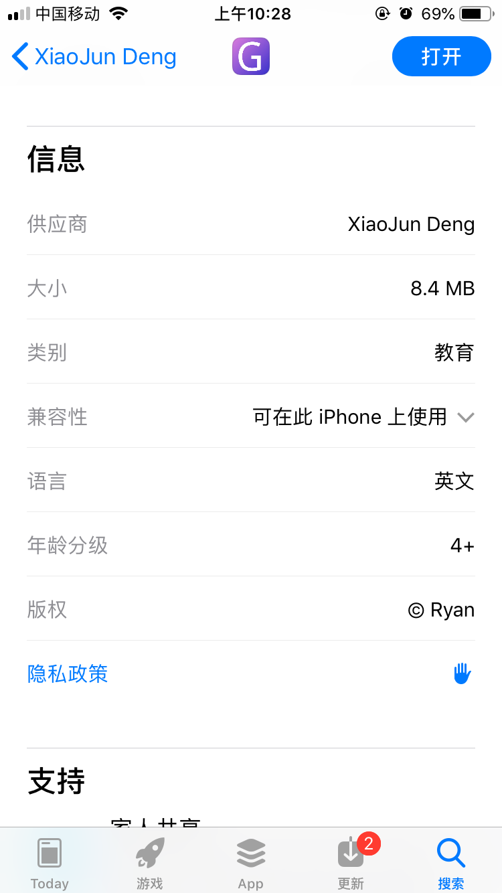
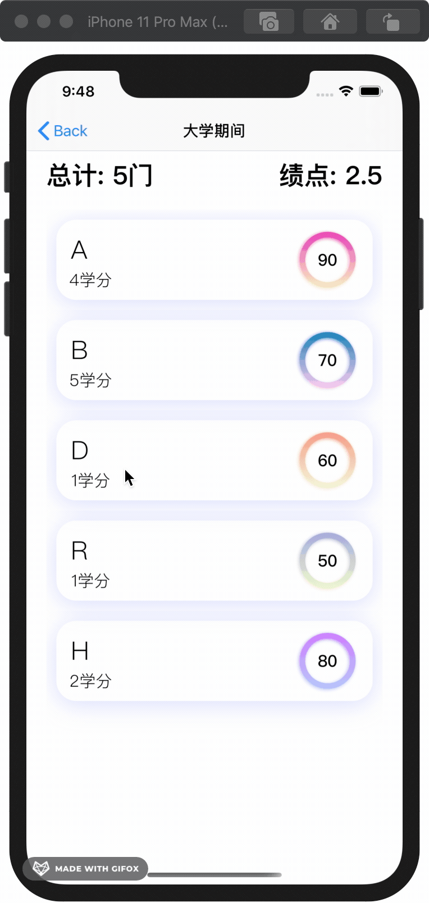
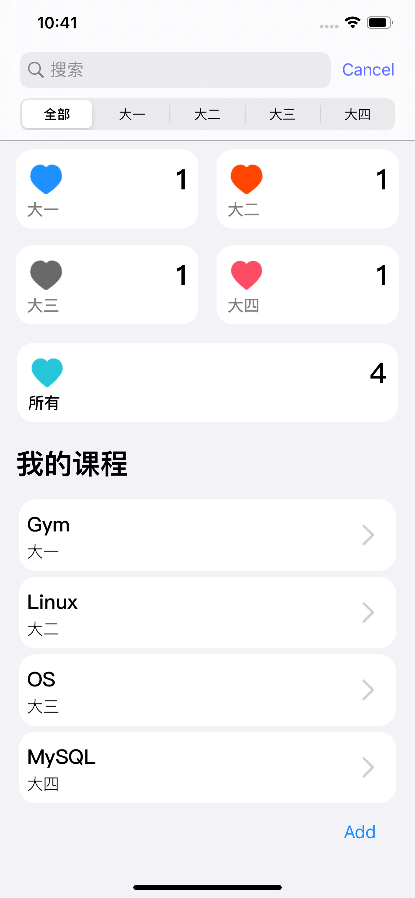

# GPA-Calculator
非常小的一款App
APP Store: GPA计算器：轻巧、快速

description: 
GPA计算器是大学生成绩管理的好帮手。

GPA计算器是一款本地化成绩管理的工具，无需网络以及其他隐私权限，用户不用担心自己的隐私数据被泄露。点击添加、滑动删除，方便快捷地记录大学课程的点点滴滴，轻松得到每学年的绩点分数。

5.27最新进度：暗黑模式适配

